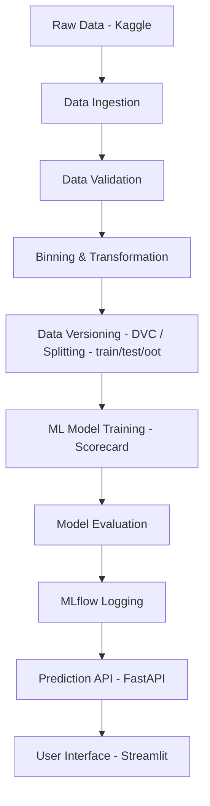

<h1 align="center">📊 Credit Score Modelling 🔍</h1>
<p align="center">
  
</p>
<p align="center">
  A robust and production-ready pipeline for Credit Risk Modeling using statistical binning, scorecard development, MLflow tracking, DVC versioning, and Streamlit visualization.
</p>

---

## 📚 Table of Contents

- [📌 Project Overview](#-project-overview)
- [✨ Key Features](#-key-features)
- [🧠 System Architecture Overview](#-system-architecture-overview)
- [📂 Project Directory Structure](#-project-directory-structure)
- [💻 Local Usage Instructions](#-local-usage-instructions)
- [🛠️ Tech Stack](#️-tech-stack)
- [🔄 DVC Pipeline Stages](#-dvc-pipeline-stages)
- [📈 MLflow Tracking](#-mlflow-tracking)
- [🧪 Evaluation Metrics](#-evaluation-metrics)
- [🗃️ Dataset Source](#️-dataset-source)
- [🧪 Research Notebooks](#-research-notebooks)
- [📤 Future Enhancements](#-future-enhancements)
- [🤝 Contributing](#-contributing)
- [📜 License](#-license)
- [📩 Contact](#-contact)

---

## 📌 Project Overview

**Credit Score Modelling** is a complete, modularized pipeline that automates the process of building, validating, and deploying credit risk models. It follows best practices of MLOps using tools like **DVC**, **MLflow**, **FastAPI**, and **Streamlit**, and applies **optimal binning** and **logistic regression** to build scorecards aligned with traditional credit risk modeling methodologies.

### 🎯 Project Goal
To develop a **credit risk scorecard** using statistical modeling principles that can:
- Evaluate loan default risk
- Visualize binning and scorecard metrics
- Be version-controlled and production-deployable
- Enable user interaction through a modern frontend

---

## ✨ Key Features

✅ **Modular ML pipeline** with DVC tracking and reproducibility  
✅ **MLflow logging** (supports both local and remote servers like DagsHub)  
✅ **Optimal binning & scaling** using `scorecardpy` and `optbinning`  
✅ **Scorecard training** with pdo/odds scaling  
✅ **Streamlit dashboard** for loan risk prediction  
✅ **FastAPI backend** for real-time serving  
✅ **Docker-ready**, CI/CD friendly architecture  

---

## 🧠 System Architecture Overview



---

## 📂 Project Directory Structure

```bash
credit-score-modelling/
├── app.py                        # Streamlit frontend
├── main.py                       # FastAPI backend
├── config/                       # YAML configs and schema
│   ├── config.yaml
│   └── schema.yaml
├── data/                         # Raw data files (Kaggle)
├── artifacts/                    # DVC-tracked outputs (data, model, metrics)
├── notebooks/                    # EDA and experimentation
├── saved_models/                 # Final scorecard and pushed models
├── src/                          # Modular source code
│   ├── components/               # Core ML pipeline components
│   ├── config/                   # Load and manage configuration
│   ├── entity/                   # Entity/data classes for config & outputs
│   ├── exception/                # Custom exceptions
│   ├── logger/                   # Logging setup
│   ├── pipeline/                 # Pipeline orchestration
│   ├── schema/                   # Input/output schema
│   └── utils/                    # Utilities (MLflow, metrics, file ops)
├── requirements.txt              # All required Python packages
├── params.yaml                   # ML model parameters
├── dvc.yaml                      # DVC pipeline stages
├── Dockerfile                    # Docker setup
├── LICENSE
└── README.md
```

---

| Folder/File   | Purpose                                                       |
| ------------- | ------------------------------------------------------------- |
| `components/` | Core steps in your ML pipeline                                |
| `entity/`     | Data classes to pass structured outputs across pipeline steps |
| `pipeline/`   | Orchestration of training/prediction steps                    |
| `config/`     | All external config, schema, and loaders                      |
| `exception/`  | Custom exception for consistent error tracking                |
| `logger/`     | Logging config and setup                                      |
| `utils/`      | Helper utilities like file ops, time utils, data I/O          |
| `artifacts/`  | Output folders for every stage to trace and reuse outputs     |
| `main.py`     | Entry point (FastAPI backend)                                 |
| `app.py`      | Streamlit (frontend), for user loan application input         |


## 💻 Local Usage Instructions

### 1. **Clone the Repository**
```bash
git clone https://github.com/kousik23naskar/credit-score-modelling.git
cd credit-score-modelling
```
### 2. **Set Up Virtual Environment with uv**
```bash
uv venv --python 3.12
source .venv/bin/activate
```
### 3. **Initialize Project with UV**
```bash
uv init
```
### 4. **Install Dependencies**
```bash
uv add -r requirements.txt
```
### 5. **Run pipeline with DVC Tracking**
```bash
dvc init
dvc repro
```
### 6. **Start Backend API (FastAPI)**
```bash
uvicorn main:app --reload
```
### 7. **Launch Streamlit Frontend**
```bash
streamlit run app.py
```

Now open your browser and go to the URL (usually `http://localhost:8501`).

## 🛠️ Tech Stack

- 🐍 **Python 3.12**

- 📦 **uv (Dependency & venv manager)**

- 📊 **optbinning, scorecardpy**

- 📋 **pandas, scikit-learn**

- 🔁 **DVC for pipeline tracking**

- 🧪 **MLflow for experiment logging**

- 🌐 **FastAPI as backend**

- 🖼️ **Streamlit for frontend**

- 🐳 **Docker for containerization**


## 🔄 DVC Pipeline Stages
```yaml
stages:
  data_ingestion: 
    cmd: PYTHONPATH=. python src/pipeline/data_ingestion_pipeline.py
  data_validation: 
    cmd: PYTHONPATH=. python src/pipeline/data_validation_pipeline.py
  data_transformation: 
    cmd: PYTHONPATH=. python src/pipeline/data_transformation_pipeline.py
  model_trainer: 
    cmd: PYTHONPATH=. python src/pipeline/model_trainer_pipeline.py
  model_evaluation: 
    cmd: PYTHONPATH=. python src/pipeline/model_evaluation_pipeline.py
  model_pusher: 
    cmd: PYTHONPATH=. python src/pipeline/model_pusher_pipeline.py
```

---

## 📈 MLflow Tracking
Supports both:

- ✅ Local MLflow tracking (mlruns folder), cmd: `mlflow ui`
- ✅ Remote tracking server (e.g., DagsHub: `mlflow.set_tracking_uri("https://dagshub.com/username/repo.mlflow")`)

Set your preferred tracking URI in `config.yaml`.

## 🧪 Evaluation Metrics
All  metrices are logged in MLflow

- ✅ AUC/GINI/KS: Your model ranks predictions very well — strong ability to distinguish defaults from non-defaults.

- ✅ PR-AUC: Reflects good precision-recall tradeoff, especially important for imbalanced datasets like credit risk.

- ✅ Brier Score: Low value confirms your predicted probabilities are well calibrated, especially when paired with your improved calibration curve. **Calibration Monitor →** recalibrate if Brier ≥ 0.20

- ✅ PSI: To detect shifts in feature distributions, monitor Population Stability Index (PSI) between training and production data. A PSI < 0.1 indicates stable distributions, while > 0.2 suggests significant shifts.

## 🗃️ Dataset Source
This project uses the Credit Risk Dataset from [Kaggle](https://www.kaggle.com/datasets/laotse/credit-risk-dataset), featuring loan and applicant attributes for binary default classification.


## 🧪 Research Notebooks
- `EDA.ipynb`: Exploratory Data Analysis
- `modelling_with_optbinning.ipynb`: Binning, WOE, IV, Model development and experimentation

## 📤 Future Enhancements

- 🔮 AutoML integration
- 📊 Dashboarding with more charts and explanations

## 🤝 Contributing
We welcome contributions!
Please open an issue or submit a pull request for improvements.

## 📜 License
This project is licensed under the [MIT License](LICENSE).

## 📩 Contact

- **Author:** Dr. Kousik Naskar

- **Email:** kousik23naskar@gmail.com

- **LinkedIn:** [Kousik Naskar](https://www.linkedin.com/in/dr-kousik-naskar/)

Thanks for exploring the Credit Score Modelling project! We hope it serves as a valuable resource for your credit risk modeling needs. If you have any questions or suggestions, feel free to reach out.